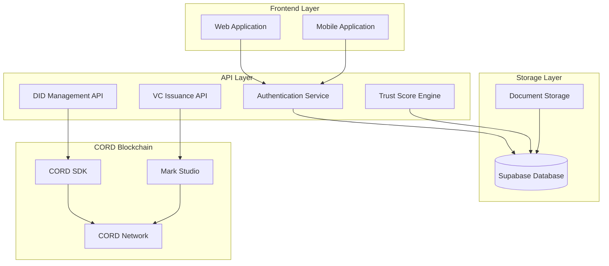
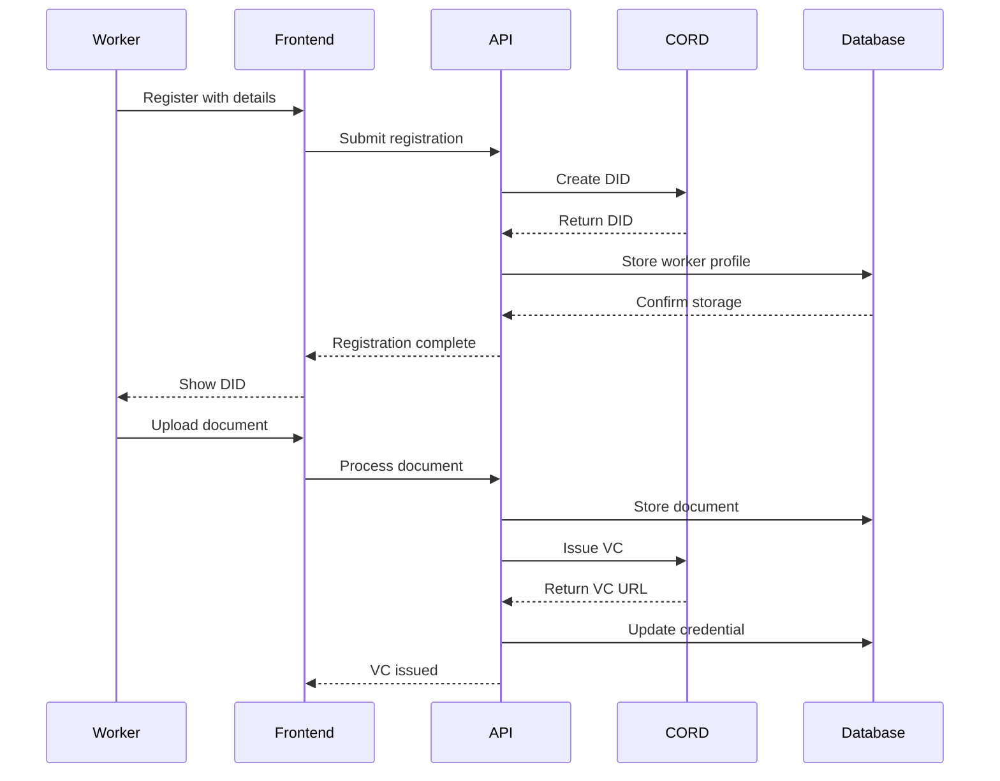

# UpandUp SSI/VC Identity Hub - Design Document

## Executive Summary

UpandUp is a blockchain-based identity and credential management platform for gig workers, built on the CORD blockchain network. This system enables security service providers and gig platforms to onboard workers with permanent, verifiable digital identities and credentials.

## System Architecture

### High-Level Architecture



### Component Architecture

#### Core Components
1. **Worker Onboarding System** - Handles DID creation and initial registration
2. **Document Management** - Upload, storage, and VC conversion pipeline
3. **Trust Score Engine** - Calculates worker reputation based on verified credentials
4. **Employer Dashboard** - Partner management and worker oversight
5. **Blockchain Integration** - CORD SDK and Mark Studio integration

#### Data Flow



## Technical Specifications

### Technology Stack
- **Frontend**: React 18, TypeScript, Tailwind CSS, Shadcn/UI
- **Backend**: Supabase (PostgreSQL, Edge Functions, Storage)
- **Blockchain**: CORD Network, CORD SDK, Mark Studio
- **Authentication**: Supabase Auth
- **State Management**: React Query

### CORD Integration Points

#### DID Creation
```typescript
interface DIDCreationRequest {
  workerDetails: {
    name: string;
    address: string;
    phone: string;
    aadhar: string;
    employer: string;
  };
}

interface DIDResponse {
  did: string;
  didDocument: object;
  blockchainStatus: 'pending' | 'confirmed';
}
```

#### VC Issuance
```typescript
interface VCIssuanceRequest {
  documentUrl: string;
  credentialType: string;
  issuer: string;
  subject: string;
}

interface VCResponse {
  vcUrl: string;
  credentialId: string;
  status: 'pending' | 'issued';
}
```

## Database Schema

### Core Tables

```sql
-- Workers table
CREATE TABLE workers (
  id UUID PRIMARY KEY DEFAULT gen_random_uuid(),
  did TEXT UNIQUE NOT NULL,
  name TEXT NOT NULL,
  phone TEXT NOT NULL,
  address TEXT NOT NULL,
  aadhar_hash TEXT NOT NULL,
  employer_id UUID REFERENCES employers(id),
  trust_score INTEGER DEFAULT 0,
  created_at TIMESTAMP DEFAULT NOW()
);

-- Credentials table
CREATE TABLE credentials (
  id UUID PRIMARY KEY DEFAULT gen_random_uuid(),
  worker_id UUID REFERENCES workers(id),
  credential_type TEXT NOT NULL,
  document_url TEXT NOT NULL,
  vc_url TEXT,
  status TEXT DEFAULT 'pending',
  issued_at TIMESTAMP DEFAULT NOW()
);

-- Employers table
CREATE TABLE employers (
  id UUID PRIMARY KEY DEFAULT gen_random_uuid(),
  name TEXT NOT NULL,
  partnership_status TEXT DEFAULT 'active',
  created_at TIMESTAMP DEFAULT NOW()
);
```

## Implementation Guide

### Phase 1: Core Infrastructure
1. Set up Supabase database and authentication
2. Implement basic worker registration
3. Create document upload functionality
4. Set up CORD SDK integration stubs

### Phase 2: Blockchain Integration
1. Integrate CORD SDK for DID creation
2. Connect Mark Studio for VC issuance
3. Implement blockchain status tracking
4. Add error handling and retry logic

### Phase 3: Advanced Features
1. Implement trust score algorithm
2. Add employer dashboard
3. Create analytics and reporting
4. Implement mobile app features

### Phase 4: Production Readiness
1. Add comprehensive testing
2. Implement monitoring and logging
3. Set up CI/CD pipelines
4. Security audit and compliance

## API Specifications

### DID Management API

#### POST /api/workers/create-did
Creates a new DID for a worker on CORD blockchain.

**Request:**
```json
{
  "name": "Rajesh Kumar",
  "phone": "+91-9876543210",
  "address": "123 Main St, Delhi",
  "aadhar": "xxxx-xxxx-1234",
  "employer": "Security Plus Services"
}
```

**Response:**
```json
{
  "success": true,
  "did": "did:cord:3x7MQY8Mz8YMW9w9cZ2jKd4N1xQ8VzYr2Pq5Fg7Hm6Kj",
  "status": "pending",
  "message": "DID creation initiated"
}
```

### VC Issuance API

#### POST /api/credentials/issue-vc
Issues a Verifiable Credential for an uploaded document.

**Request:**
```json
{
  "workerId": "uuid",
  "documentUrl": "https://storage.url/doc.pdf",
  "credentialType": "voter-id",
  "metadata": {
    "issuer": "Election Commission of India",
    "issueDate": "2023-01-15"
  }
}
```

**Response:**
```json
{
  "success": true,
  "vcUrl": "https://cord-vc.dhiway.com/credential/abc123",
  "credentialId": "uuid",
  "status": "issued"
}
```

## Development Team Onboarding

### Quick Start
1. Clone the repository
2. Set up Supabase project
3. Configure CORD SDK credentials
4. Run `npm install && npm run dev`

### Development Environment
- Node.js 18+
- Supabase CLI
- CORD SDK access
- Mark Studio credentials

### Code Standards
- TypeScript strict mode
- ESLint + Prettier
- Component-based architecture
- Test-driven development

## Security Considerations

### Data Protection
- PII encryption at rest
- Secure document storage
- Audit logging
- GDPR compliance

### Blockchain Security
- Private key management
- Transaction signing
- Network security
- Recovery mechanisms

## Testing Strategy

### Unit Tests
- Component testing with Jest/RTL
- API endpoint testing
- Utility function testing

### Integration Tests
- CORD SDK integration
- Database operations
- Authentication flows

### End-to-End Tests
- Complete user journeys
- Mobile app testing
- Cross-browser compatibility

## Deployment Architecture

### Production Environment
- Vercel/Netlify for frontend
- Supabase for backend
- CORD Network for blockchain
- CDN for document storage

### Monitoring
- Application performance monitoring
- Error tracking
- Blockchain transaction monitoring
- User analytics

## Future Enhancements

### Planned Features
1. Multi-language support
2. Advanced analytics dashboard
3. Integration with job platforms
4. Mobile biometric authentication
5. Automated credential verification

### Scalability Considerations
- Database sharding strategies
- Caching layers
- Load balancing
- Microservices architecture

---

*This document serves as the primary reference for the UpandUp SSI/VC Identity Hub development. It should be updated as the system evolves.*
